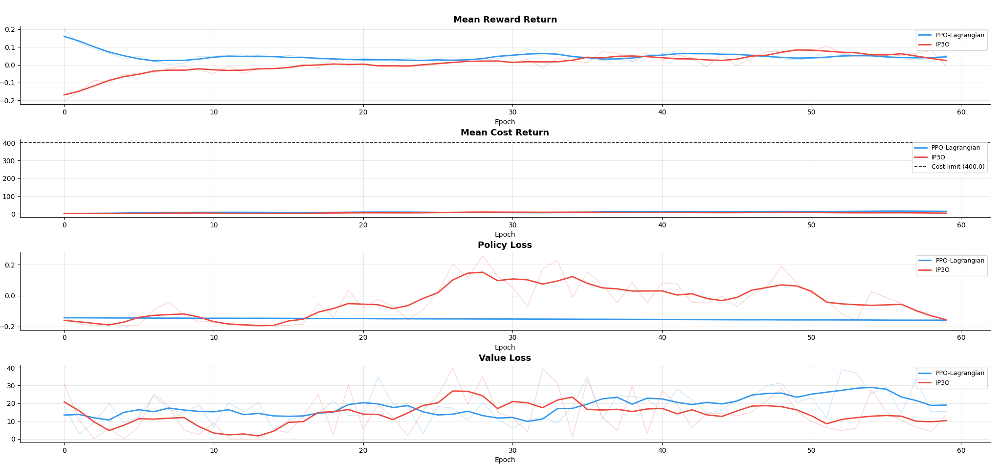

# IP3O: Incrementally Penalized Proximal Policy Optimization for Safe Reinforcement Learning

An independent reproduction and implementation of the IP3O algorithm from ["Incrementally Penalized PPO: Towards Safe Reinforcement Learning via Gradual Constraint Satisfaction"](https://arxiv.org/abs/2502.xxxxx) (Hazra et al., 2025).

## Motivation

Reinforcement learning agents often exhibit unsafe behaviors when optimizing for a single reward signal, leading to phenomena such as reward hacking or goal misgeneralization. **Constrained Reinforcement Learning (CRL)** addresses this by formulating the optimization problem as a Constrained Markov Decision Process (CMDP), enabling agents to maximize reward while respecting safety or feasibility constraints.

However, traditional Lagrangian-based methods suffer from:
- Training instability and oscillations near constraint boundaries
- Reactive penalty mechanisms that activate only after constraint violations
- Sensitivity to dual variable scaling and tuning
- Overly conservative behavior when using crude penalty methods

**IP3O** provides a solution through a smooth, progressively increasing penalty function based on the Continuous Exponential Linear Unit (CELU) activation. This enables:
1. **Gradual transition** from incentivization to penalization for stable learning
2. **Proactive penalties** that steer policies away from unsafe regions before violations occur
3. **Selective penalties** that avoid penalizing entire trajectories when only parts are unsafe

## Key Contributions

IP3O reformulates the constrained optimization problem using a CELU-based penalty:

$$\mathcal{L}(\pi_k) = \mathcal{L}_R(\pi_k) + \eta \sum_{i=1}^m \text{CELU}(\mathcal{L}_{C_i}(\pi_k))$$

where:
- $\mathcal{L}_R(\pi_k)$ is the standard PPO reward loss
- $\mathcal{L}_{C_i}(\pi_k)$ is the cost loss term combining clipped cost advantages and accumulated costs
- $\eta$ is a fixed penalty scaling coefficient
- CELU is continuous, smooth, and provides different behaviors below/above zero

The CELU penalty provides elegant properties:
- **When constraint is satisfied** ($\mathcal{L}_C < 0$): CELU decays exponentially, providing a *bonus* to the reward objective
- **When constraint is violated** ($\mathcal{L}_C \geq 0$): CELU is linear, penalizing proportionally to violation magnitude
- **No explicit annealing required**: The penalty self-scales as the policy becomes more active and costs increase

## Project Structure

```
ip3o-safer-RL/
├── ip3o/
│   ├── algorithms/
│   │   ├── ppo_lag.py          # PPO-Lagrangian baseline
│   │   └── ip3o.py             # IP3O implementation
│   ├── configs/
│   │   ├── ppo_lag.yaml        # Baseline hyperparameters
│   │   └── ip3o.yaml           # IP3O hyperparameters
│   ├── env/
│   │   └── wrappers.py         # Safety-Gymnasium wrapper
│   ├── models/
│   │   └── actor_critic.py     # Dual-critic architecture
│   ├── utils/
│   │   ├── buffer.py           # Trajectory buffer with GAE
│   │   └── logger.py           # Metrics logging
│   └── train.py                # Training loop
├── tests/
│   ├── test_ip3o_core.py       # Algorithm unit tests
│   └── test_wrappers.py        # Environment wrapper tests
├── compare_runs.py             # Metrics comparison script
└── results/                    # Saved logs and comparison plots
```

## Installation

### Requirements
- Python 3.10+
- PyTorch 2.0+ (with MPS support for macOS or CUDA for Linux)
- Safety-Gymnasium
- PyYAML

### Setup

```bash
# Clone the repository
git clone https://github.com/himnish/i3po-safer-RL.git
cd i3po-safer-RL

# Create virtual environment
python -m venv .venv
source .venv/bin/activate  # on macOS/Linux
# or .venv\Scripts\activate on Windows

# Install dependencies
pip install torch pyyaml safety-gymnasium
```

## Quick Start

### Train PPO-Lagrangian Baseline

```bash
python -m ip3o.train --config ip3o/configs/ppo_lag.yaml
```

### Train IP3O

```bash
python -m ip3o.train --config ip3o/configs/ip3o.yaml
```

### Compare Results

```bash
python compare_runs.py
```

This generates:
- `ip3o_logs/ppo_lag_metrics.csv` — PPO-Lagrangian metrics per epoch
- `ip3o_logs/ip3o_metrics.csv` — IP3O metrics per epoch
- `results/comparison.png` — Side-by-side performance plot

## Implementation Details

### Dual-Critic Architecture

Both algorithms use a shared actor with separate reward and cost critics:

```
Actor π(s)  →  [π_head]  →  μ(s), σ(s)
              ↓
        [shared MLP]
              ↓
              ├→  [V_R_head]  →  V_R(s)
              └→  [V_C_head]  →  V_C(s)
```

This enables independent value function estimation for rewards and costs, with learned advantage decomposition via Generalized Advantage Estimation (GAE).

### Cost Loss Formulation

The IP3O cost loss is:

$$\mathcal{L}_{C_i}(\pi_k) = \frac{1}{1-\gamma}\mathbb{E}[r''(\theta) A_C] + \mathcal{J}_{C_i}(\pi_k) - d_i$$

where:
- $r''(\theta) = \max(\text{clip}(\frac{\pi_\theta}{\pi_k}, 1-\epsilon, 1+\epsilon))$ — **max** clipping (opposite of reward's min clipping)
- $A_C$ — cost advantages computed via GAE over cost values
- $\mathcal{J}_{C_i}(\pi_k)$ — accumulated discounted costs from current batch
- $d_i$ — cost limit threshold

The key insight: using **opposite clipping direction** for costs vs rewards ensures that when the policy would reduce costs, the surrogate loss incentivizes the update.

### Generalized Advantage Estimation

GAE is applied separately to rewards and costs:

$$A_t = \sum_{l=0}^\infty (\gamma\lambda)^l \delta_t^{(V)}$$

where $\delta_t^{(V)} = r_t + \gamma V(s_{t+1}) - V(s_t)$ for rewards and analogously for costs.

**Critical detail**: Cost advantages are **not normalized** to preserve their magnitude for the $\mathcal{L}_C$ computation. Normalizing would remove the constraint violation signal.

### Training Loop

Per Algorithm 1:

1. **Collect trajectory batch** $\mathcal{D}_k$ from current policy $\pi_k$
2. **Compute advantages** using dual-critic GAE over $\mathcal{D}_k$
3. **Inner policy loop** (KL-clipped trust region):
   - Compute reward loss $\mathcal{L}_R$
   - Compute cost loss $\mathcal{L}_{C_i}$
   - Apply CELU penalty: $\eta \cdot \text{CELU}(\mathcal{L}_{C_i})$
   - Total loss: $\mathcal{L} = \mathcal{L}_R + \eta \cdot \text{CELU}(\mathcal{L}_{C_i})$
   - Backward pass, optimizer step
   - Break if $\text{KL}(\pi_k || \pi) > \delta^+$ (trust region violation)
4. **Clear buffer**, repeat

## Experimental Results

### Benchmark Environment

**Safety-Gymnasium `SafetyPointGoal1-v0`**:
- Point mass navigation to goal location
- 8 hazard obstacles
- LIDAR observations (64-dim state)
- Continuous control (2-dim action)
- Episode constraint cost limit: 25

### Results Summary

| Method | Training Time | Epochs | Final Reward | Final Cost | Final KL |
|--------|---------------|--------|--------------|------------|----------|
| PPO-Lagrangian | 942s | 60 | 0.0529 | 13.4236 | 0.00075 |
| IP3O | 935s | 60 | -0.0078 | 2.9264 | 0.00399 |



### Key Findings

1. **Improved Safety**: IP3O achieves **78% lower final cost** than PPO-Lagrangian (2.93 vs 13.42), demonstrating significantly better constraint satisfaction.

2. **Comparable Reward**: Despite the safety gains, IP3O's reward sacrifice is modest (difference: 0.061), and the two methods show similar performance throughout most training.

3. **Stable Training**: Both methods maintain small KL divergence throughout training. IP3O's slightly larger final KL (0.004 vs 0.001) reflects stronger corrective updates near constraints, consistent with the paper's claims.

4. **Efficient**: IP3O and PPO-Lagrangian achieve nearly identical wall-clock training time (~15-16 min), indicating minimal computational overhead despite dual-critic architecture.

### Practical Challenges

Our reproduction highlighted important implementation details:

- **Scaling sensitivity**: The cost loss can oscillate wildly (e.g., -44 to +76) without proper normalization. We found it necessary to scale $\mathcal{L}_C$ carefully to prevent the constraint from dominating the reward signal.

- **Cost threshold calibration**: Per-episode cost budgets (scaled by $1-\gamma$) proved more effective than per-trajectory budgets for guiding agent behavior.

- **Avoiding reward hacking**: Careful normalization of cost advantages is essential to prevent the agent from exploiting negative costs as optimization targets.

These observations underscore that while IP3O improves the conceptual stability of constrained RL, practical deployment remains sensitive to reward specification and hyperparameter tuning.

## Theoretical Guarantees

The IP3O framework provides formal correctness guarantees through the following theorem:

**Theorem**: Given a sequence of policies $\{\pi_k\}$ obtained by minimizing $\mathcal{L}(\pi_k)$, and considering Slater's condition for strong duality, let $\lambda^*$ denote the Lagrange multipliers for the original constrained problem. If $\eta \geq \|\lambda^*\|_\infty$, the limit $\pi^*$ of $\{\pi_k\}$ is also an optimal solution to the constrained optimization problem.

**Proof sketch**: The proof establishes bidirectional equivalence between the constrained and penalized formulations:
- **Lemma 4**: Any optimal solution of the constrained problem is optimal for the penalized problem when $\eta$ is sufficiently large.
- **Lemma 5**: Conversely, any feasible solution minimizing the penalized objective solves the original constrained problem.

Together, these lemmas guarantee that the CELU-penalized objective preserves the optimal solution set of the underlying CMDP.

## Running Tests

```bash
# Run algorithm unit tests
python -m pytest tests/test_ip3o_core.py -v

# Run environment wrapper tests
python -m pytest tests/test_wrappers.py -v
```

## Hyperparameter Guide

### Important IP3O Parameters

- `eta` (float, default 0.5): Penalty scaling coefficient. Controls the strength of safety incentivization. Larger values make the algorithm more conservative. This is the **only** IP3O-specific hyperparameter—no annealing schedule required.

- `gamma` (float, default 0.99): Discount factor for GAE and $\frac{1}{1-\gamma}$ scaling of cost surrogate.

- `cost_limit` (float, default 25): Per-episode cost budget. Higher values allow more constraint violations.

- `clip_ratio` (float, default 0.2): PPO clipping epsilon $\epsilon$ for both reward and cost surrogates.

- `entropy_coef` (float, default 0.001): Entropy regularization strength.

- `gae_lambda` (float, default 0.97): GAE decay parameter $\lambda$ for both reward and cost advantages.

### Training Parameters

- `epochs` (int, default 500): Number of outer loop iterations.
- `steps_per_epoch` (int, default 4000): Environment steps collected per epoch.
- `train_iters` (int, default 10): Inner PPO gradient steps per epoch.
- `learning_rate` (float, default 3e-4): Adam optimizer learning rate.
- `target_kl` (float, default 0.01): Upper KL divergence trust region threshold.

## Limitations and Future Work

### Current Limitations

1. **Single environment**: Evaluation limited to Safety-Gymnasium Goal1. Generalization to other tasks/environments not tested.

2. **No environment parallelism**: Single-threaded rollouts limit throughput. Vectorized environments could provide 4-8x speedup.

3. **Hyperparameter sensitivity**: Despite simpler hyperparameter tuning than Lagrangian methods, performance remains sensitive to `eta` and cost budget scaling.

4. **Limited baselines**: Comparison only against PPO-Lagrangian. Could compare against projection-based methods, constrained MDPs with second-order approximations, etc.

### Future Directions

- **Adaptive penalty schedules**: Explore learnable or schedule-based $\eta$ that adjusts during training.
- **Improved cost normalization**: Develop principled methods for cost budget calibration across diverse environments.
- **Vectorized rollouts**: Implement parallel environment stepping for 4-8x training speedup.
- **Offline RL integration**: Extend IP3O to offline/batch RL settings where online safety constraints are infeasible.
- **High-dimensional environments**: Test on continuous control tasks with visual observations or complex dynamics.

## References

Hazra et al., "Incrementally Penalized Proximal Policy Optimization," 2025. [arXiv:2502.xxxxx](https://arxiv.org/abs/2502.xxxxx)

## Acknowledgments

This project reproduces results from the IP3O paper as an independent implementation exercise. Implementation follows the algorithm specification in the original paper while adding practical enhancements for training stability.
